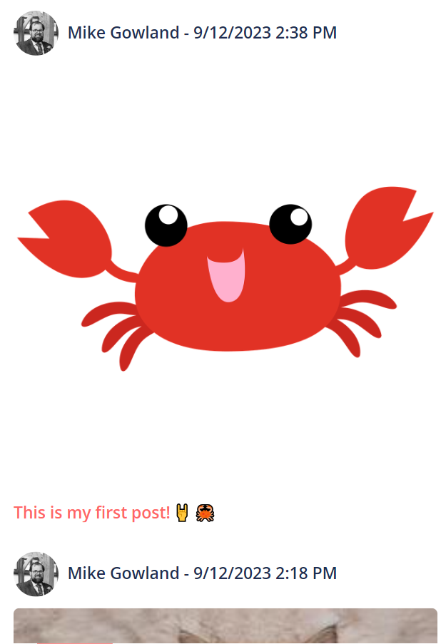
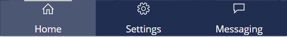
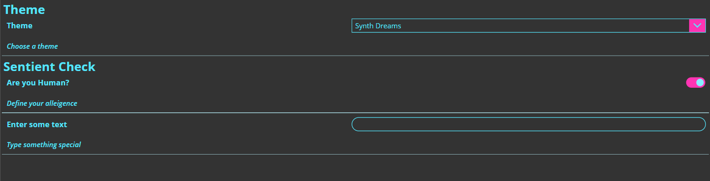

# The Social Media Kit
## A Component Library inspired by Social Media Services 👍

# The Social Media Kit

This is the first of what I hope to be many component libraries.

This is the Social Media Kit - A Canvas Apps Component Library inspired by Social Media Apps.

## But does that mean I need to use as a Social Media App? 🤔🤔🤔

**Of course not!** The Social Media Kit is a collection of components that can be used individually, or together, to help speed up app development time so makers can focus on the important bits.

This Component Library includes

## Header 

Includes a version with/without a search text box. Clickable Left and Right Icons with a button state that can be read from the component itself

## Feed

A feed of posts that are clickable to a target screen. Shows user details, time posted, images and feed text. Likes, Comments and Shares will be GA when Behaviour Formulas are 😀

## Toolbar

A configurable toolbar that sits nicely at the top or bottom of a screen, can also act like a dock at the bottom of the screen. Configurable with Target Screens, BuiltIn Icons and Label Text (all of which can be hidden/shown depending on preferences).

## Form

A configurable Infinity Form that allows for Text, DropDown and Toggle based input. Outputs accessible.

# Plus Others!!

## Theming

All components follow a consistent theming approach which is easy to configure and usable by other controls in your apps. Makers can even utilise the upcoming Modern Theming Control. More information on theming can be found <a href="./Theming.md">here</a>

# Installation

This repo provides the following files:

+ /unmanaged/ComponentLibraryTheSocialMediaKit.zip
  + The Unmanaged Solution ready to load into your environment
+ /unmanaged
